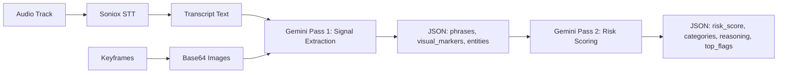
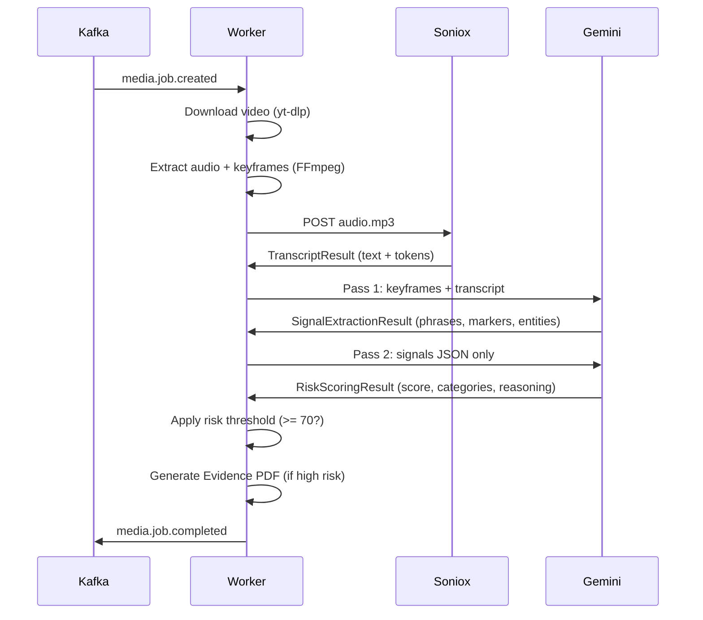

# AI Media Watch — How Scam & Fraud Detection Works

> Detailed breakdown of how the media-worker analyzes TikTok and Instagram
> videos to detect illegal gambling, pyramid schemes, and investment fraud.

---

## 1. Overview

The detection pipeline uses a **two-pass AI analysis chain** powered by Google Gemini 1.5 Flash. It does not use regex, keyword blacklists, or manual rules. Instead, it combines:

- **Speech-to-text** of the video's audio (Kazakh/Russian via Soniox)
- **Visual analysis** of keyframes extracted every 3 seconds
- **Two sequential Gemini prompts** — one to extract signals, one to score risk



---

## 2. What Signals Does It Look For?

### 2.1 Fraud Categories

Every detected signal is classified into one of four categories:

| Category | What It Detects | Examples |
|---|---|---|
| **illegal_gambling** | Unlicensed betting, casino promotions, sports gambling without license | "1xBet", "Pin-up", "win real money", casino logo overlays, slot machine footage |
| **pyramid_scheme** | Multi-level marketing, recruitment-based schemes, matrix programs | "invite 3 people", "passive income", "recruit to earn", hierarchy diagrams |
| **investment_fraud** | Guaranteed returns, fake trading platforms, crypto scams | "100% profit guaranteed", "no risk", "get rich quick", fake trading screenshots |
| **referral_scheme** | Referral-based rewards, affiliate fraud, bounty programs | "share link to earn", "refer a friend get bonus", referral codes, bonus banners |

### 2.2 Signal Types

**Pass 1 extracts three types of signals:**

#### a) Flagged Phrases (`phrases[]`)

Suspicious spoken or text-overlay phrases detected in the video's audio transcript or on-screen text. Each phrase includes:
- `text` — the exact phrase (e.g., "100% guaranteed income")
- `timestamp_s` — when in the video it appears (seconds)
- `category` — which fraud category it belongs to

**Examples of flagged phrases:**
```
"гарантированный доход 100%"        → investment_fraud
"переходи по реферальной ссылке"     → referral_scheme
"ставки без риска"                  → illegal_gambling
"пригласи 3 друзей и получи бонус"   → pyramid_scheme
"инвестируй сейчас"                 → investment_fraud
"зарегистрируйся по ссылке"         → referral_scheme
```

#### b) Visual Markers (`visual_markers[]`)

Suspicious visual elements detected in keyframe images. Each marker includes:
- `frame_index` — which keyframe (1 = 3 seconds, 2 = 6 seconds, etc.)
- `description` — what was seen and why it's suspicious
- `category` — which fraud category

**Examples of visual markers:**
```
Frame 7: "1xBet logo overlay visible in top-right corner"           → illegal_gambling
Frame 14: "Aggressive call-to-action banner with phone number"       → referral_scheme
Frame 5: "Screenshot of trading dashboard showing fake profits"     → investment_fraud
Frame 11: "Matrix hierarchy diagram showing recruitment levels"     → pyramid_scheme
```

#### c) Entities (`entities[]`)

Named brands, people, or platforms mentioned or shown. Each entity includes:
- `name` — the entity name
- `type` — `brand`, `person`, or `platform`

**Examples:**
```
{ name: "1xBet",         type: "brand" }
{ name: "@finance_guru", type: "person" }
{ name: "Telegram",      type: "platform" }
```

---

## 3. The Two-Pass Gemini Chain

### 3.1 Pass 1 — Signal Extraction

**Purpose:** Extract everything suspicious from the video without judging severity.

**Input:**
- Up to 20 keyframe images (encoded as base64 JPEG)
- Full Soniox transcript text

**Model:** `gemini-2.0-flash` with `temperature=0.1` (low randomness for consistent extraction)

**System prompt (full):**
```
You are a fraud-signal extractor. Given video keyframes and a transcript,
identify and return ONLY a JSON object with no preamble or markdown.

Schema:
{
  "phrases": [
    {"text": str, "timestamp_s": int, "category": str}
  ],
  "visual_markers": [
    {"frame_index": int, "description": str, "category": str}
  ],
  "entities": [
    {"name": str, "type": "brand|person|platform"}
  ]
}

Categories: illegal_gambling | pyramid_scheme | investment_fraud | referral_scheme | other

If nothing suspicious is found, return empty arrays.
```

**Why Pass 1 exists separately:**
- Focuses the model on a single task (extraction only, no judgment)
- Produces an auditable intermediate result
- Keeps Pass 2 input small (JSON only, no images)

### 3.2 Pass 2 — Risk Scoring

**Purpose:** Evaluate the severity of the extracted signals and produce a final score.

**Input:** Pass 1 JSON output only (no images, no transcript)

**Model:** `gemini-2.0-flash` with `temperature=0.1`

**System prompt (full):**
```
You are a fraud risk scorer. Given extracted fraud signals, return ONLY JSON
with no preamble or markdown.

Schema:
{
  "risk_score": int (0-100),
  "confidence": "low"|"medium"|"high",
  "categories": {
    "illegal_gambling": int,
    "pyramid_scheme": int,
    "investment_fraud": int,
    "referral_scheme": int
  },
  "reasoning": str,
  "top_flags": [
    {"signal": str, "weight": "high"|"medium"|"low"}
  ]
}

Score 0 if no evidence. Score 70+ only for clear, direct violations.
```

**Scoring logic applied by Gemini:**
- Multiple signals in the same category → higher category score
- High-weight flags → overall score boost
- Explicit calls to action, promises of money, unlicensed platforms → higher severity
- Educational/disclaimer content → lower severity

### 3.3 Risk Tier Calculation

After Gemini returns the score, the worker applies hard thresholds:

| Score | Tier | Color | Action |
|---|---|---|---|
| 70–100 | High Risk | Red | Auto-flagged. Evidence Pack PDF generated automatically. Ready for prosecution. |
| 40–69 | Medium Risk | Amber | Added to manual review queue. Inspector must review and decide. |
| 0–39 | Low Risk | Green | Archived. No evidence pack. No action needed. |

---

## 4. Audio Transcription (Soniox)

Soniox provides **Kazakh/Russian code-switched speech-to-text**. This is critical because:

- Central Asian fraud content frequently mixes Kazakh and Russian in the same sentence
- Example: "Сіздің инвестицияңыз 100% кірісті қамтамасыз етеді — переходи по ссылке"
- Standard STT models fail on code-switched audio
- Soniox returns per-word language tags for the chain of custody

**Transcription output structure:**
```python
TranscriptResult(
    text="Сіздің инвестицияңыз 100% кірісті қамтамасыз етеді переходи по ссылке",
    tokens=[
        Token("Сіздің", start_ms=0, end_ms=500, lang="kk"),
        Token("инвестицияңыз", start_ms=500, end_ms=1200, lang="kk"),
        Token("100%", start_ms=1200, end_ms=1600, lang="kk"),
        Token("переходи", start_ms=3000, end_ms=3500, lang="ru"),
        Token("по", start_ms=3500, end_ms=3700, lang="ru"),
        Token("ссылке", start_ms=3700, end_ms=4200, lang="ru"),
    ],
    soniox_job_id="soniox-abc-123"
)
```

---

## 5. Visual Analysis Via Keyframes

### 5.1 Frame Extraction

FFmpeg extracts **1 JPEG keyframe every 3 seconds** of video:

```bash
ffmpeg -i source.mp4 -vf fps=1/3 -q:v 2 frame_%03d.jpg
```

- A 60-second video produces ~20 keyframes
- Maximum 20 frames are sent to Gemini (token limit)
- Frames are encoded as base64 data URIs

### 5.2 What Gemini Looks For In Images

The model visually scans each keyframe for:

| Visual Signal | What It Looks Like |
|---|---|
| **Brand logos** | 1xBet, Pin-Up, MostBet, Parimatch, etc. |
| **Call-to-action banners** | "Click here", "Register now", "Get bonus" overlays |
| **Fake trading screens** | Stock/crypto charts with unrealistic gains |
| **Recruitment diagrams** | Pyramid hierarchy charts, MLM structures |
| **Payment proofs** | Screenshots of fake earnings, transfer confirmations |
| **QR codes / referral links** | Scannable codes directing to Telegram groups |
| **Celebrity deepfakes** | Fake endorsements using public figures |

---

## 6. Output Example

Here's what a complete detection result looks like when a video is found to contain illegal gambling:

```json
{
  "risk_score": 88,
  "confidence": "high",
  "reasoning": "High risk (88/100). Soniox detected guaranteed income promise at 0:12. Gemini identified 1xBet logo overlay at frame 7 and aggressive referral call-to-action at frame 14.",
  "categories": {
    "illegal_gambling": 91,
    "pyramid_scheme": 42,
    "investment_fraud": 65,
    "referral_scheme": 78
  },
  "top_flags": [
    {"signal": "guaranteed income phrase at 0:12", "weight": "high"},
    {"signal": "1xBet logo at frame 7", "weight": "high"},
    {"signal": "referral CTA at frame 14", "weight": "medium"}
  ],
  "phrases": [
    {"text": " guaranteed 100% income", "timestamp_s": 12, "category": "investment_fraud"},
    {"text": " переходи по реферальной ссылке", "timestamp_s": 34, "category": "referral_scheme"}
  ],
  "visual_markers": [
    {"frame_index": 7, "description": "1xBet logo overlay visible in top-right corner", "category": "illegal_gambling"},
    {"frame_index": 14, "description": "Aggressive call-to-action banner with phone number", "category": "referral_scheme"}
  ],
  "entities": [
    {"name": "1xBet", "type": "brand"},
    {"name": "@finance_guru", "type": "person"}
  ]
}
```

---

## 7. Mock Detection Mode

For development and demos without API keys, the worker has a **mock detection mode** that returns realistic but deterministic results. This is activated when `SONIOX_API_KEY` or `GEMINI_API_KEY` is empty or set to `mock_key`.

### Mock Pass 1 — Signal Extraction

Always returns the same canned signals:

```json
{
  "phrases": [
    {"text": "guaranteed 100% income", "timestamp_s": 12, "category": "investment_fraud"},
    {"text": "переходи по реферальной ссылке", "timestamp_s": 34, "category": "referral_scheme"}
  ],
  "visual_markers": [
    {"frame_index": 7, "description": "1xBet logo overlay visible in top-right corner", "category": "illegal_gambling"},
    {"frame_index": 14, "description": "Aggressive call-to-action banner with phone number", "category": "referral_scheme"}
  ],
  "entities": [
    {"name": "1xBet", "type": "brand"},
    {"name": "@finance_guru", "type": "person"}
  ]
}
```

### Mock Pass 2 — Risk Scoring

```json
{
  "risk_score": 88,
  "confidence": "high",
  "categories": {
    "illegal_gambling": 91,
    "pyramid_scheme": 42,
    "investment_fraud": 65,
    "referral_scheme": 78
  },
  "reasoning": "High risk (88/100). Soniox detected guaranteed income promise at 0:12. Gemini identified 1xBet logo overlay at frame 7 and aggressive referral call-to-action at frame 14.",
  "top_flags": [
    {"signal": "guaranteed income phrase at 0:12", "weight": "high"},
    {"signal": "1xBet logo frame 7", "weight": "high"},
    {"signal": "referral call-to-action frame 14", "weight": "medium"}
  ]
}
```

---

## 8. Error Handling & Edge Cases

| Scenario | Detection Behavior |
|---|---|
| **Video has no audio** | Soniox returns empty transcript. Pass 1 runs on keyframes only. |
| **Video is entirely legitimate** | Pass 1 returns empty arrays. Pass 2 scores all categories at 0. |
| **Gemini rate-limited** | Retries 3 times with exponential backoff (2s → 4s → 8s). Falls back to mock result on exhaustion. |
| **Soniox API fails** | Returns mock transcript. Pipeline continues. |
| **No keyframes extracted** | Pass 1 runs on transcript only. Visual markers will be empty. |
| **yt-dlp blocked by platform** | Writes a placeholder. Pipeline continues in limited mock mode. |

---

## 9. Detection Limitations (Known)

1. **Gemini context window** — Only 20 keyframes (~60 seconds of video) can be analyzed per job. Longer videos are truncated.
2. **No audio language detection** — If video audio is in a language other than KZ/RU/EN, transcription accuracy drops.
3. **Static analysis only** — The model sees individual frames, not motion. A flashing scam banner between keyframes could be missed.
4. **No URL crawling** — Referral links are detected visually/textually but not followed or analyzed.
5. **Mock mode is deterministic** — It always returns the same scores. Useful for pipeline testing but not for real detection.

---

## 10. Data Flow Summary


