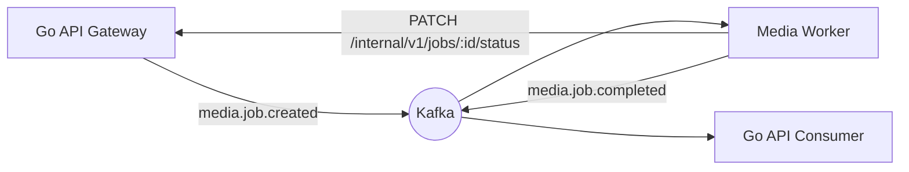
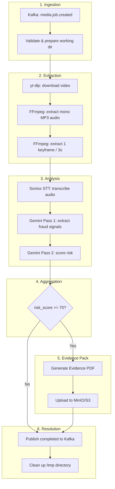
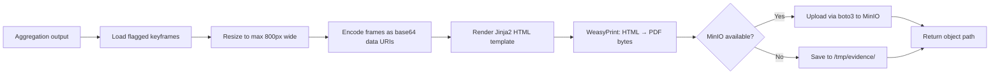
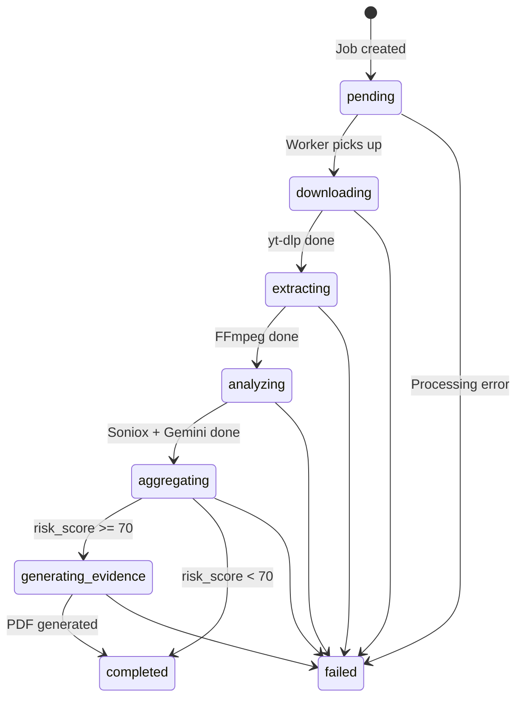
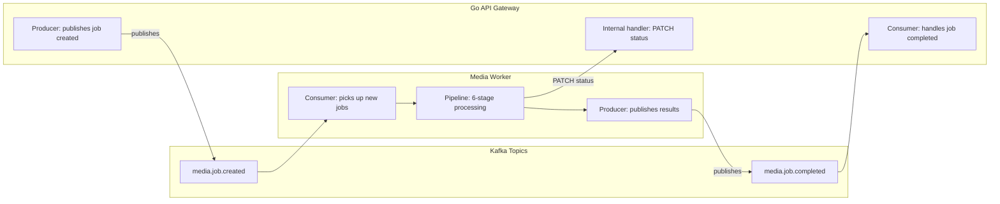

# AI Media Watch — Media Worker Explanation

> How the Python-based media processing pipeline works end-to-end.

---

## 1. Role in the System

The media-worker is the **analysis engine** of AI Media Watch. It's an async Kafka consumer written in Python 3.11 that:

- Downloads videos from TikTok/Instagram via **yt-dlp**
- Extracts audio tracks and keyframes via **FFmpeg**
- Transcribes speech via **Soniox STT** (KZ/RU code-switched)
- Runs a **two-pass Gemini 1.5 Flash** analysis to detect fraud signals
- Generates **Evidence Pack PDFs** for high-risk content via WeasyPrint
- Publishes results back to **Kafka** for the Go API to consume

It never exposes HTTP endpoints — all communication is async through Kafka, except for status updates which go through the Go API's internal REST endpoint.



---

## 2. Directory Structure

```
media-worker/
├── Dockerfile                     # python:3.11-slim + ffmpeg + weasyprint
├── .env.example                    # All env vars with defaults
├── requirements.txt                # Python dependencies
├── src/
│   ├── main.py                     # Entry point — pipeline orchestrator
│   ├── config.py                   # Environment-based configuration
│   ├── extractor/
│   │   ├── downloader.py           # yt-dlp wrapper
│   │   └── ffmpeg_processor.py     # FFmpeg audio + keyframe extraction
│   ├── analyzer/
│   │   ├── soniox_client.py        # Soniox STT client
│   │   └── gemini_client.py        # Gemini two-pass analysis client
│   ├── pdfgen/
│   │   ├── generator.py            # Evidence Pack PDF generator
│   │   └── templates/
│   │       └── evidence_report.html # Jinja2 PDF template
│   └── queue/
│       ├── consumer.py             # Kafka consumer (media.job.created)
│       └── producer.py             # Kafka producer (media.job.completed)
```

---

## 3. The Pipeline (6 Stages)

Each submitted URL goes through these stages sequentially:



### Stage-by-stage detail

#### Stage 1 — Ingestion (consumer.py + main.py)

The `JobConsumer` subscribes to the `media.job.created` Kafka topic with consumer group `python-worker-consumer`. When a message arrives:

```python
# Kafka message payload
{
    "job_id":       "uuid",           # from Go API
    "url":          "string",         # TikTok/Instagram URL
    "platform":     "tiktok|instagram",
    "priority":     1|2|3,
    "inspector_id": "uuid",
    "submitted_at": "ISO8601"
}
```

The consumer uses **manual offset commits** (`enable.auto.commit=False`) — it only commits after the entire pipeline succeeds. If processing crashes mid-way, the message is redelivered.

A working directory is created at `/tmp/mediawatch-jobs/{job_id}/` for all intermediate files.

**Status sync:** Immediately after receiving the job, the worker calls:

```
PATCH /internal/v1/jobs/{job_id}/status
Authorization: Bearer {internal_token}
Body: {"status": "downloading"}
```

This tells the Go API to update the PostgreSQL job status so the frontend can show live progress.

#### Stage 2 — Extraction (downloader.py + ffmpeg_processor.py)

**Video Download** (`downloader.py`):

```python
yt_dlp_opts = {
    'format': 'bestvideo[ext=mp4]+bestaudio[ext=m4a]/best[ext=mp4]/best',
    'outtmpl': '/tmp/mediawatch-jobs/{job_id}/source.mp4',
}
```

- Uses yt-dlp with `--ignoreerrors` fallback
- On download failure (platform blocking), writes a mock placeholder so the pipeline continues gracefully
- **Mock mode:** Skips actual download, writes a placeholder file

**Audio Extraction** (`ffmpeg_processor.py`):

```bash
ffmpeg -i source.mp4 -q:a 0 -map a -ac 1 -acodec libmp3lame audio.mp3
```

- Extracts a **mono MP3** track at the best available quality
- Mono is required by Soniox for optimal STT accuracy

**Keyframe Extraction** (`ffmpeg_processor.py`):

```bash
ffmpeg -i source.mp4 -vf fps=1/3 -q:v 2 frame_%03d.jpg
```

- Extracts **1 JPEG keyframe every 3 seconds**
- Each frame is named `frame_001.jpg`, `frame_002.jpg`, etc.
- Maximum 20 frames are passed to Gemini (to stay within token limits)
- **Mock mode:** Generates tiny 1x1 black pixel JPEGs for pipeline testing

**Status sync:** The worker PATCHes `extracting`, then `analyzing` as it progresses.

#### Stage 3 — Analysis (soniox_client.py + gemini_client.py)

##### Soniox STT (soniox_client.py)

```
POST audio.mp3 → Soniox API → TranscriptResult
```

Returns:
- `text`: Full concatenated transcript text
- `tokens[]`: Per-word timestamps with language tags (kk, ru), confidence scores
- `soniox_job_id`: API reference for audit trail

Supports **Kazakh/Russian code-switched** transcription — the key requirement for detecting fraud in Central Asian social media.

**Mock mode:** Returns a canned transcript with mock tokens containing typical fraud phrases like "guaranteed 100% income" and "referral link".

##### Gemini Two-Pass Chain (gemini_client.py)

This is the core AI logic — a two-pass prompt chain that separates signal extraction from risk scoring.

**Pass 1 — Signal Extraction:**

```
Input:  keyframe images (base64, up to 20) + full transcript text
Model:  gemini-2.0-flash (temperature=0.1)
Output: structured fraud signals as JSON
```

System prompt:
```
You are a fraud-signal extractor. Given video keyframes and a transcript,
identify and return ONLY a JSON object with no preamble or markdown.

Schema:
{
  "phrases": [{"text": str, "timestamp_s": int, "category": str}],
  "visual_markers": [{"frame_index": int, "description": str, "category": str}],
  "entities": [{"name": str, "type": "brand|person|platform"}]
}
Categories: illegal_gambling | pyramid_scheme | investment_fraud | referral_scheme | other
```

**Pass 2 — Risk Scoring:**

```
Input:  Pass 1 JSON output
Model:  gemini-2.0-flash (temperature=0.1)
Output: risk score + category breakdown + top flags as JSON
```

System prompt:
```
You are a fraud risk scorer. Given extracted fraud signals, return ONLY JSON.

Schema:
{
  "risk_score": int (0-100),
  "confidence": "low"|"medium"|"high",
  "categories": {
    "illegal_gambling": int,
    "pyramid_scheme": int,
    "investment_fraud": int,
    "referral_scheme": int
  },
  "reasoning": str,
  "top_flags": [{"signal": str, "weight": "high"|"medium"|"low"}]
}
```

Two-pass design rationale:
- **Pass 1 is a pure extraction pass** — it identifies what's suspicious without judging severity
- **Pass 2 is a scoring pass** — it evaluates how severe the identified signals are
- Separate passes make each model call simpler, more focused, and auditable
- Each pass records a `request_id` in the chain of custody log

Both passes use retry logic with exponential backoff:
```
Retry 1: wait 2s
Retry 2: wait 4s
Retry 3: wait 8s
```

#### Stage 4 — Aggregation (main.py)

The aggregator step combines the Soniox transcript and Gemini JSON into a final result set:

- Ensures `risk_score` is an integer 0-100
- Clamps all category scores
- Builds the `top_flags` list from Pass 2 output
- Collects `flagged_texts` from Pass 1 for inline transcript highlighting
- Defines the risk tier:

| Score Range | Tier | Color | Action |
|---|---|---|---|
| 70-100 | High | Red | Auto-flag + Evidence Pack PDF |
| 40-69 | Medium | Amber | Manual review queue |
| 0-39 | Low | Green | Archived |

**Status sync:** The worker PATCHes `aggregating`.

#### Stage 5 — Evidence Pack (generator.py)

Only runs when `risk_score >= 70`. This is the **key differentiator** — a prosecution-ready PDF report.

**Generation flow:**



**PDF structure** (7 sections):

1. **Cover page** — Report ID, timestamp, source URL, platform, inspector ID, risk score badge
2. **Executive summary** — AI-generated reasoning in plain language
3. **Risk score breakdown** — Per-category table + top flags with weight badges
4. **Flagged keyframes** — Embedded JPEGs with frame index, timestamp, AI description
5. **Audio transcript** — Full Soniox transcript with flagged phrases highlighted in red
6. **Technical metadata** — Video URL, platform, Soniox job ID, Gemini request IDs, AI model versions
7. **Chain of custody** — Auto-generated log of every processing stage with timestamps

**Storage:**

The PDF is stored as an **S3 object** at `evidence-packs/{job_id}.pdf` in MinIO (or any S3-compatible store). The **object path** (not a signed URL) is sent in the Kafka event so the Go API can generate fresh **presigned URLs** on each download request — avoiding the 7-day expiry problem.

**Status sync:** The worker PATCHes `generating_evidence`.

#### Stage 6 — Resolution (producer.py + main.py)

The final step publishes the result to Kafka:

```python
# Kafka: media.job.completed
{
    "job_id":       "uuid",
    "status":       "completed",           # or "failed"
    "risk_score":   88,
    "confidence":   "high",
    "reasoning":    "High risk (88/100)...",
    "categories":   {
        "illegal_gambbling": 91,
        "pyramid_scheme":    42,
        "investment_fraud":  65,
        "referral_scheme":   78
    },
    "top_flags": [
        {"signal": "guaranteed income phrase at 0:12", "weight": "high"},
        {"signal": "1xBet logo frame 7",               "weight": "high"}
    ],
    "evidence_url": "evidence-packs/xxx.pdf",   # object path, not signed URL
    "error":        null
}
```

The Go API's Kafka consumer picks this up and:
1. Updates the job's `risk_score`, `confidence`, `reasoning`, `evidence_url` in PostgreSQL
2. Upserts the per-category scores into `analysis.results`
3. The frontend's polling detects `status=completed` and navigates to the report

**Cleanup:** The worker always removes `/tmp/mediawatch-jobs/{job_id}/` in a `finally` block, even on failure.

---

## 4. State Machine



Status transitions are validated by the Go API's state machine to prevent illegal transitions (e.g., `completed` → `analyzing`).

---

## 5. Mock Mode vs Live Mode

The worker has a built-in mock mode for development and demos. It activates when API keys are missing or set to `mock_key`.

| Feature | Mock Mode | Live Mode |
|---|---|---|
| Video download | Writes a placeholder file | yt-dlp downloads real video |
| FFmpeg | Generates 5 tiny 1x1 JPEG keyframes | Real audio + keyframe extraction |
| Soniox STT | Returns canned transcript with mock fraud phrases | Real Soniox API call |
| Gemini | Returns deterministic mock scores (risk=88, gambling=91) | Real Gemini API calls |
| Kafka | Prints to stdout instead of publishing | Publishes to real Kafka broker |
| Evidence Pack | Generates locally or uploads to MinIO | Same (identical code path) |
| Status sync | Prints to stdout instead of HTTP PATCH | Real PATCH to Go API |

**Startup logic** (from `main.py`):

```python
if Config.IS_MOCK_MODE:
    process_job(mock_job)  # Run one synthetic job, then exit
else:
    while running:
        job = consumer.poll(timeout_s=5.0)
        if job:
            process_job(job)
```

In mock mode, the worker runs **one complete pipeline cycle** with synthetic data and then exits — perfect for CI/CD verification.

---

## 6. Integration Points



### Connection Details

| Integration | Protocol | Endpoint | Auth |
|---|---|---|---|
| Job submission | Kafka | `media.job.created` | None (internal network) |
| Status updates | HTTP | `PATCH /internal/v1/jobs/:id/status` | Bearer token |
| Results delivery | Kafka | `media.job.completed` | None (internal network) |
| Evidence storage | S3 API | MinIO on port 9000 | Access key + secret key |

---

## 7. Environment Variables

All configuration comes from environment variables (see `.env.example`):

```env
# Kafka — broker and topic configuration
KAFKA_BROKERS=localhost:9092
KAFKA_GROUP_ID=python-worker-consumer
KAFKA_TOPIC_JOB_CREATED=media.job.created
KAFKA_TOPIC_JOB_COMPLETED=media.job.completed

# Go API — for job status synchronization
GO_API_BASE_URL=http://localhost:8080
GO_API_INTERNAL_TOKEN=internal-service-token-change-me

# AI APIs — keys enable live mode; mock_key enables mock mode
SONIOX_API_KEY=your-soniox-key-here
GEMINI_API_KEY=your-gemini-key-here
GEMINI_MODEL=gemini-1.5-flash-latest

# S3/MinIO — evidence pack storage
S3_ENDPOINT=localhost:9000
S3_ACCESS_KEY=minioadmin
S3_SECRET_KEY=minioadminpass
S3_BUCKET_NAME=evidence-packs
S3_USE_SSL=false

# Processing parameters
TMP_DIR=/tmp/mediawatch-jobs
MAX_VIDEO_DURATION_SECONDS=600
KEYFRAME_INTERVAL_SECONDS=3
KEYFRAME_MAX_WIDTH_PX=800
AUDIO_SAMPLE_RATE_HZ=16000
EVIDENCE_RISK_THRESHOLD=70

# Gemini retry/rate limiting
GEMINI_MAX_RETRIES=3
GEMINI_RETRY_BACKOFF_BASE_SECONDS=2
```

---

## 8. Error Handling

| Scenario | Behavior |
|---|---|
| yt-dlp download fails | Writes placeholder, pipeline continues in mock mode |
| FFmpeg extraction fails | Falls back to mock keyframes/audio |
| Soniox API error | Logs error, returns mock transcript |
| Gemini API error | Retries 3x with backoff, returns empty result on exhaustion |
| Kafka publish fails | Logs error, result is lost (no DLQ in MVP) |
| Disk full / temp dir issues | Exception propagates up, job marked as failed in Kafka |
| Unexpected exception anywhere | Caught in `process_job`, publishes failed event, cleans up temp dir |

All errors are logged at the point of failure with full context (job_id, stage, error message).

---

## 9. Chain of Custody

Every processing stage records a timestamped entry in the custody log:

```json
[
    {"timestamp": "2026-06-20T09:14:22Z", "stage": "ingestion",        "status": "Job received from Kafka"},
    {"timestamp": "2026-06-20T09:14:25Z", "stage": "download",         "status": "Video downloaded via yt-dlp"},
    {"timestamp": "2026-06-20T09:14:30Z", "stage": "extraction",       "status": "Extracted audio + 12 keyframes via FFmpeg"},
    {"timestamp": "2026-06-20T09:14:35Z", "stage": "soniox_stt",       "status": "Transcribed 42 tokens (job=soniox-abc123)"},
    {"timestamp": "2026-06-20T09:14:40Z", "stage": "gemini_pass1",     "status": "Extracted 3 phrases, 2 visual markers"},
    {"timestamp": "2026-06-20T09:14:42Z", "stage": "gemini_pass2",     "status": "Risk score=88, confidence=high"},
    {"timestamp": "2026-06-20T09:14:45Z", "stage": "evidence_pack",    "status": "Generating PDF — risk >= 70"},
    {"timestamp": "2026-06-20T09:14:48Z", "stage": "evidence_pack",    "status": "PDF stored → evidence-packs/xxx.pdf"}
]
```

This log is embedded in the Evidence Pack PDF as Section 7, making it suitable for legal admissibility.

---

## 10. Resource Constraints

The worker runs on a GCP e2-small VM (2GB total memory):

| Constraint | Value |
|---|---|
| Container memory limit | 450M |
| Container memory reservation | 256M |
| Max video duration | 600 seconds (10 min) |
| Max keyframes sent to Gemini | 20 |
| Keyframe interval | 3 seconds |
| Temp directory | `/tmp/mediawatch-jobs` |
| PDF generation peak memory | ~200MB (WeasyPrint) |

The `--no-compile` pip flag is set in the Dockerfile to skip `.pyc` compilation, saving ~30% on the Python image layer size.
